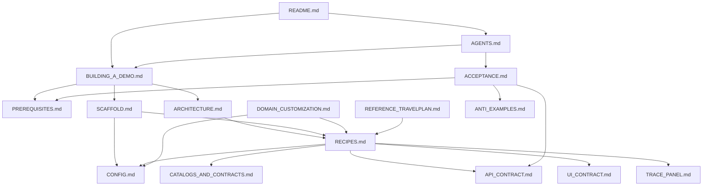

# Plan: Zeus Client Python — Demo Builder Kit

**Date**: 2026-07-15  
**Task**: Author an AI-executable documentation kit so coding agents can build vertical demos like `demo_travel_sample` on top of `zeus_client_python`.  
**Priority**: High  
**Estimated Effort**: 12–16 hours / 7 phases (structure + content + TravelPlan annotations + acceptance harness)

## 1. Context & Requirements

- **Goal**: A complete **Demo Builder Kit** that an AI model (or human integrator) can follow end-to-end to produce a productized demo app with:
  - Natural-language search UI + HTTP API
  - `kotenai-zeus-client` agent loop (`run_agent`)
  - Domain-specific result cards + structured extraction
  - Multi-turn chat store + durable Zeus sessions
  - Floating Zeus chat-trace panel
  - Config/env bootstrap, catalog sync, Docker monorepo layout
  - Unit tests + smoke acceptance checklist
- **Success criteria**:
  - An AI given only the kit + `zeus_client_python` can scaffold a non-travel vertical (e.g. beer analytics) without reverse-engineering TravelPlan
  - TravelPlan remains the **canonical reference implementation**, mapped recipe-by-recipe
  - Kit pages are linkable from SDK docs (`integration-tips` / new “Build a demo” page) and loadable by agents via `AGENTS.md` / skill
- **Constraints**:
  - Do not re-document full Zeus Engine OpenAPI or the entire Python SDK
  - Prefer recipes + contracts over prose; every recipe points at real files in this monorepo
  - Config and env patterns must match current `kotenai-zeus-client` (`zeus` + `llm_provider`, import-time constants)
  - Docker networking and monorepo `file:../zeus_client_python` layout are first-class
  - **Web frameworks (v1)**: document **Flask and FastAPI** (Flask remains TravelPlan reference; FastAPI as native-async alternative)
  - **Trace panel (v1)**: **vendored JS only** as the default recipe; document CDN/sibling as optional alternate (not required)
  - **Domain presets (v1)**: **travel + customization guide only** (no beer/retail preset packs)
- **Assumptions**:
  - Operator supplies Zeus URL/auth, loaded sample scope, LLM key, and domain story
  - Reference implementation: `demo_travel_sample` (this repo)
  - Library: sibling `../zeus_client_python`
  - Existing guides (`.grok/guides/TRAVEL_PLANNER.md`, `ZEUS_CLIENT_INTEGRATION.md`, `DEMO_OUTPUT_SCHEMA.md`, etc.) are source material, not the public kit
  - GitBook site can host a separate **Demo** section with language variants (Python first; Node/C#/Java later) — same pattern as Zeus Client
- **Out of Scope**:
  - Implementing a second demo app in this plan (kit only)
  - Cookiecutter generator / CLI scaffold tool (optional follow-up)
  - Multi-language **demo** content for Node/C#/Java — Python kit first (GitBook section/variant slots may exist empty or as stubs later)
  - Production multi-tenant auth, contract publishing UI, Helios Motions
  - Replacing GitBook SDK docs; kit **links into** them
  - Beer/retail preset packs (v1.1+)

## 2. Analysis & Research

### 2.1 Key files explored

| Area | Paths |
|------|--------|
| Reference demo | `demo_travel_sample/README.md`, `src/travel_planner/{app,search,async_runner,zeus_config,output_schema,results_parser,answer_parser,chat_store}.py`, `config.example.json`, `Dockerfile`, `docker-compose.yml`, `pyproject.toml` |
| Library | `zeus_client_python/README.md`, `examples/minimal_agent.py`, `src/data/config.example.json` |
| SDK docs scaffold | `koten_docs_scaffold/zeus-client/python/{README,getting-started,integration-tips,contracts-and-catalog,agent-loop,faq}.md` |
| Internal guides | `.grok/guides/{TRAVEL_PLANNER,ZEUS_CLIENT_INTEGRATION,DEMO_OUTPUT_SCHEMA,MARKDOWN_ANSWER_PARSER}.md` |
| Related plans | `.grok/plans/{TRAVEL_PLANNER_APP,REPLACE_VENDOR_ZEUS_CLIENT,ZEUS_CLIENT_MULTI_LANG_DOCS}.md` |

### 2.2 Gap analysis

| Layer | Status | Kit action |
|-------|--------|------------|
| SDK concepts / agent loop | Strong in GitBook scaffold | Link only |
| Minimal agent | `examples/minimal_agent.py` | Link; contrast with full demo |
| App glue patterns | Partial in `integration-tips.md` | Expand into recipe book |
| Vertical product architecture | Only in TravelPlan source + internal guides | New blueprint + annotated walkthrough |
| Domain parameterization | Implicit (travel-only) | New customization table |
| AI agent build order / acceptance | Missing | New agent instructions + checklist |
| Machine-checkable API contract | Informal in README | New OpenAPI-lite / schema page |

### 2.3 Potential risks / edge cases

- **Docs drift vs client** → Pin kit to client version; note `/v2/session` vs old `/v1` shims; verify snippets against current `run_agent` signature
- **AI copies travel domain blindly** → Domain customization page mandatory; anti-examples section
- **Import-order bugs** → Recipe #1 (env before import) with fail cases
- **Sync vs async frameworks** → Document Flask bridge *and* native-async FastAPI alternative
- **Catalog offline demos** → Document bundled vs stamped catalogs; when sync is required
- **Trace panel dependency** → Document vendored `zeus_client_chat_trace` vs sibling package build
- **Secrets in generated config** → Explicit “never commit api_key” rules in scaffold

### 2.4 Alternatives considered

| Approach | Pros | Cons | Decision |
|----------|------|------|----------|
| A. Expand only `integration-tips.md` | Small change | Not AI-executable; no scaffold/API/domain | Reject as sole solution |
| B. Full kit in `zeus_client_python/docs/demo-builder/` | Lives with library; ships with package | Needs PR to client repo | **Primary publish target** |
| C. Kit only in `demo_travel_sample/.grok/` | Easy to draft here | Not discoverable for AIs building *new* demos | Draft + internal link only |
| D. Kit in `koten_docs` GitBook | Public UX | Longer publish path; less ideal for agent file load | **Secondary** — one “Build a demo” page linking to repo kit |
| E. Template repo / cookiecutter | Fastest codegen | Maintenance cost; out of scope for v1 | Follow-up after kit stabilizes |

**Publish strategy (v1)**: Author content under proposed tree in `zeus_client_python/docs/demo-builder/` (or monorepo mirror). Until client-repo PR lands, draft/source of truth for structure lives in this plan; optional working copies under `demo_travel_sample/docs/demo-builder/` if content is written before the client PR.

### 2.5 Kit audience model

```
Human product owner          AI coding agent              Human integrator
        │                           │                            │
        ▼                           ▼                            ▼
  DOMAIN inputs              BUILDING_A_DEMO.md            SCAFFOLD + recipes
  (sample, entities)         (entry + build order)         (implement & ship)
        │                           │                            │
        └───────────────────────────┴────────────────────────────┘
                                    │
                          ACCEPTANCE.md (done?)
```

## 3. Full Kit Structure (deliverable tree)

### 3.1 Target filesystem layout

```text
zeus_client_python/docs/demo-builder/     # PRIMARY publish location
├── README.md                             # Kit index + how to use (AI & human)
├── BUILDING_A_DEMO.md                    # Entrypoint: intent, inputs, build order
├── ARCHITECTURE.md                       # Layers, sequence, module map
├── PREREQUISITES.md                      # Zeus, sample, LLM, Docker, monorepo
├── CONFIG.md                             # Annotated config + env matrix
├── RECIPES.md                            # Named integration patterns (code)
├── DOMAIN_CUSTOMIZATION.md               # Parameterize mode/sample/schema/UI
├── SCAFFOLD.md                           # File tree, pyproject, Docker templates
├── API_CONTRACT.md                       # HTTP request/response schemas
├── UI_CONTRACT.md                        # Frontend stack + JSON fields consumed
├── CATALOGS_AND_CONTRACTS.md             # Demo checklist for chat_request/sync
├── TRACE_PANEL.md                        # Embed chat-trace + tool-order
├── ACCEPTANCE.md                         # Tests, smoke, troubleshooting
├── REFERENCE_TRAVELPLAN.md               # Annotated map → demo_travel_sample
├── ANTI_EXAMPLES.md                      # Common AI failure modes
├── AGENTS.md                             # Drop-in instructions for coding agents
├── templates/                            # Copy-paste skeletons (not a full app)
│   ├── config.example.json
│   ├── pyproject.toml.snippet
│   ├── Dockerfile.snippet
│   ├── docker-compose.yml.snippet
│   ├── zeus_config.py
│   ├── async_runner.py
│   ├── search.py.stub
│   ├── app.py.stub
│   ├── output_schema.py.stub
│   └── openapi-demo.yaml
└── presets/                              # v1: travel only; other domains via DOMAIN_CUSTOMIZATION
    └── travel.md                         # Annotated TravelPlan preset (not a second app)
```

**Secondary surfaces** (thin wrappers, not full copies):

| Surface | Content |
|---------|---------|
| GitBook site `site_jqufk` **Section: Demo** | Language **variants** under Demo (Python default now; Node/C#/Java later) — see §3.10 |
| `koten_docs_scaffold/demo/python/` (or space git path) | Full Demo Builder Kit content published as the Python Demo space |
| Optional teaser under Zeus Client | Short “Build a demo” link page pointing at Demo section (avoid duplicating kit) |
| `demo_travel_sample/README.md` | Badge/link: “Reference demo for Demo Builder Kit” |
| `demo_travel_sample/.grok/guides/DEMO_BUILDER_KIT.md` | Feature guide after content ships (AGENTS.md template) |
| Optional skill | `.grok/skills/build-zeus-demo/SKILL.md` — load kit when user says “build a Zeus demo” |

### 3.2 Document inventory (purpose, inputs, outputs)

| # | File | Purpose | Must include | Source material |
|---|------|---------|--------------|-----------------|
| 0 | `README.md` | Kit home | Reading order (AI vs human), version pin, links to SDK docs | This plan §3–4 |
| 1 | `BUILDING_A_DEMO.md` | **AI entrypoint** | Success criteria, required human inputs, phased build order, “do not invent” rules | Plan §1 + TravelPlan README Features |
| 2 | `ARCHITECTURE.md` | System blueprint | Mermaid sequence, layer diagram, app-vs-library boundary, module responsibility table | `README.md` mermaid, `TRAVEL_PLANNER` guide |
| 3 | `PREREQUISITES.md` | Environment truth | Zeus readiness, sample data, contracts, LLM, Python, monorepo paths, Docker networking | `config.example.json`, README Prerequisites |
| 4 | `CONFIG.md` | Config cookbook | Full annotated JSON, env table, legacy key note, import-time env rule | Library config docs + demo config |
| 5 | `RECIPES.md` | Glue patterns | 10 named recipes with complete snippets + reference file paths | `search.py`, `async_runner.py`, `zeus_config.py`, … |
| 6 | `DOMAIN_CUSTOMIZATION.md` | Vertical parameterization | Tables: mode, sample, prompt, output_schema, parsers, UI copy; worked non-travel sketch | `output_schema.py`, catalogs |
| 7 | `SCAFFOLD.md` | Project skeleton | Target tree, package-data, deps, Docker context, CLI entry | `pyproject.toml`, `Dockerfile` |
| 8 | `API_CONTRACT.md` | Machine contract | `POST /api/search`, `GET /api/tool-order`, errors; JSON Schema or OpenAPI | README API section |
| 9 | `UI_CONTRACT.md` | Frontend contract | Stack defaults, card fields, empty/error states, trace button | `templates/index.html`, static JS |
| 10 | `CATALOGS_AND_CONTRACTS.md` | Ops for demos | Sync on startup, local dir layout, scope_contracts keys, offline vs stamped | `contracts-and-catalog.md`, `verify_config.py` |
| 11 | `TRACE_PANEL.md` | Debug UX | **Default:** vendor `zeus_client_chat_trace.js` into `static/`; optional CDN/sibling build note; tool-order endpoint | `static/zeus_client_chat_trace.js`, `tool_order` |
| 12 | `ACCEPTANCE.md` | Definition of done | Unit/integration/smoke, troubleshooting matrix, self-repair loop for AI | README Troubleshooting + tests/ |
| 13 | `REFERENCE_TRAVELPLAN.md` | Annotated walkthrough | File-by-file “why this exists” map to recipes | Entire `src/travel_planner/` |
| 14 | `ANTI_EXAMPLES.md` | Failure modes | Import order, missing init_http, no output_schema, localhost-in-Docker, fake Zeus APIs | Integration bugs from guides |
| 15 | `AGENTS.md` | Agent system prompt | Condensed build order + mandatory checks + link table | BUILDING + ACCEPTANCE |

### 3.3 Recipe catalog (for `RECIPES.md`)

Each recipe must have: **Name**, **When to use**, **Complete snippet**, **Reference path**, **Failure mode**.

| ID | Recipe name | Reference implementation |
|----|-------------|--------------------------|
| R01 | Env-before-import | `src/travel_planner/zeus_config.py` + `__init__.py` |
| R02 | Background asyncio loop (Flask / sync frameworks) | `async_runner.py` |
| R02b | Native async app (FastAPI) — no thread loop | New snippet (use `async def` routes + `ZeusClient` lifespan) |
| R03 | HTTP lifecycle (`init_http` / `close_http` / `ZeusClient`) | `async_runner.startup` / `shutdown` |
| R04 | Startup catalog sync | `async_runner._sync_chat_requests_on_startup` + config `chat_requests_sync` |
| R05 | Domain `run_agent` wrapper | `search.py` (`structured=True`, mode, sample triple, prompt prefix) |
| R06 | `output_schema` allowlist for UI cards | `output_schema.py` + guide `DEMO_OUTPUT_SCHEMA.md` |
| R07 | Result waterfall (`zeus_data` → trace → markdown) | `search.py` + `results_parser` + `answer_parser` |
| R08 | Multi-turn chat store + session IDs | `chat_store.py` + `search.py` session fields |
| R09 | Minimal HTTP API surface | `app.py` |
| R10 | Trace tool-order + **vendored** panel embed (CDN optional note) | `build_tool_order`, static JS, `TRACE_PANEL.md` |
| R11 | Docker monorepo client install | `Dockerfile`, `docker-compose.yml` |
| R12 | Config verification script (optional) | `scripts/verify_config.py` |

### 3.4 Build order (for `BUILDING_A_DEMO.md` / `AGENTS.md`)

Mandatory phased order for coding agents:

```text
Phase 0  Collect human inputs (PREREQUISITES + domain knobs)
Phase 1  Scaffold project tree + pyproject + config.example (SCAFFOLD)
Phase 2  zeus_config + package __init__ import order (R01)
Phase 3  async_runner + startup/shutdown (R02–R04)
Phase 4  output_schema + domain search wrapper (R05–R07)
Phase 5  chat_store multi-turn (R08)
Phase 6  Flask/FastAPI routes per API_CONTRACT (R09)
Phase 7  UI per UI_CONTRACT + TRACE_PANEL (R10)
Phase 8  Docker compose (R11)
Phase 9  Tests + run ACCEPTANCE checklist
Phase 10 Write demo README (copy structure from TravelPlan README)
```

### 3.5 Required human inputs block (template)

```markdown
## Operator inputs (fill before generation)

| Input | Example | Required |
|-------|---------|----------|
| Zeus base URL | `http://localhost:8080` | yes |
| Auth mode + credentials | basic / demo user | yes |
| Sample bucket/scope/collection | `travel-sample/_default/_default` | yes |
| Agent mode(s) | `travel_booking` | yes |
| Contract bindings | mode → contract_id/hash | recommended |
| LLM base_url + api_key + model | xAI / OpenAI | yes |
| Domain entity types + card fields | Hotel: name, description, image | yes |
| Example NL queries (3+) | "warm beaches under $2000" | yes |
| Install mode | monorepo path vs wheel | yes |
| Web framework | Flask (default) / FastAPI | optional |
```

### 3.6 Page dependency graph



### 3.7 Content templates (section outlines)

#### `BUILDING_A_DEMO.md` outline

1. Goal & success criteria (checkbox list)
2. What this kit is / is not
3. Operator inputs table (empty form)
4. Non-negotiable rules (env-before-import, real Zeus, no fake agent frameworks)
5. Phased build order (Phase 0–10)
6. Where to read next by role
7. Link to ACCEPTANCE

#### `ARCHITECTURE.md` outline

1. Layer diagram (UI → API → domain wrapper → library → Zeus/LLM)
2. Sequence diagram (copy/adapt TravelPlan mermaid)
3. Module responsibility table (generic names + TravelPlan mapping)
4. App-owned vs library-owned state (chat store, config dir, catalogs)
5. Sync vs async deployment notes

#### `RECIPES.md` outline

- One H2 per recipe R01–R12
- Subsections: When / Code / Reference / Failures / Related

#### `DOMAIN_CUSTOMIZATION.md` outline

1. Knob table (mode, sample, prompt, schema, parsers, UI)
2. How to derive `output_schema` from scope brief / MINI-SCHEMA
3. Result mapper strategy (field synonyms)
4. Worked sketch: beer-sample analytics demo (no full code)
5. Checklist: “domain swap complete”

#### `ACCEPTANCE.md` outline

1. Automated tests (parsers, API with mocked `run_agent`)
2. Manual smoke (Docker up → query → cards + trace)
3. Config verification
4. Troubleshooting table (extend TravelPlan README)
5. AI self-repair loop (symptom → doc section → re-test)

#### `AGENTS.md` outline (agent-facing, terse)

1. Mission one-liner
2. Load order of kit files
3. Hard constraints
4. Build phases (short)
5. Done = ACCEPTANCE all green
6. Reference paths to TravelPlan only when stuck

### 3.8 Templates package (`templates/`)

| Template | Notes |
|----------|--------|
| `config.example.json` | Generic placeholders; comments via `_comment` keys; `default_mode` / `samples` tokens |
| `pyproject.toml.snippet` | `kotenai-zeus-client` path + Flask deps + package-data |
| `Dockerfile.snippet` | Parent-context monorepo build pattern |
| `docker-compose.yml.snippet` | Port 5000, `ZEUS_URL`, config volume |
| `zeus_config.py` | Drop-in R01 |
| `async_runner.py` | Drop-in R02–R04 |
| `search.py.stub` | TODOs for prompt, mode, schema |
| `app.py.stub` | Routes matching API_CONTRACT |
| `output_schema.py.stub` | Empty entity map + reserved fields note |
| `openapi-demo.yaml` | Search + tool-order paths |

Templates must be **runnable after domain fill-in**, not half-travel copies.

### 3.9 Versioning & maintenance

| Item | Policy |
|------|--------|
| Kit version | Semver in `README.md` (start `1.0.0`) |
| Client compatibility | Document tested `kotenai-zeus-client` version / commit |
| Zeus API | Prefer `/v2`; document session path requirement |
| Drift review | When `run_agent` signature or config shape changes, update RECIPES + templates |
| TravelPlan map | Update `REFERENCE_TRAVELPLAN.md` when demo modules move |

### 3.10 GitBook site structure — Section **Demo**

Yes — GitBook supports this. It is the **same pattern** already planned for **Zeus Client** (section + language variants), applied to a second product area.

**Target site structure** (`site_jqufk`):

```text
site_jqufk
├── Section: Zeus Client          # existing / planned SDK docs
│   ├── Variant: Python (default)
│   ├── Variant: Node
│   ├── Variant: C#
│   └── Variant: Java
└── Section: Demo                 # NEW — demo builder / vertical demos
    ├── Variant: Python (default) → space “Demo Python” (now)
    ├── Variant: Node             → later
    ├── Variant: C#               → later
    └── Variant: Java             → later
```

| Section | Variant | Space title (suggested) | Git sync path (suggested) |
|---------|---------|-------------------------|---------------------------|
| Demo | **Python** (default) | Demo Python | `demo/python` (or `docs/demo-builder` if single-lang repo path) |
| Demo | Node | Demo Node | `demo/node` (later) |
| Demo | C# | Demo C# | `demo/csharp` (later) |
| Demo | Java | Demo Java | `demo/java` (later) |

**Wire-up (GitBook UI)** — Sites → `site_jqufk` → Settings → **Structure**:

1. **Add section** named `Demo` (sibling of `Zeus Client`, not nested inside it).
2. Create space **Demo Python** in the docs collection (if it does not exist).
3. Enable **Git Sync** for that space → repo + path to Python demo kit content.
4. Under section Demo, **Add variant** → attach Demo Python space; set title **Python**; mark **default**.
5. Later: create Demo Node / C# / Java spaces, parallel TOC/slugs, add as variants under the same Demo section.
6. Order variants: Python → Node → C# → Java (or as you prefer).

**Why section + variants (not one mixed TOC)**

- Readers pick language via the variant switcher (same UX as Zeus Client).
- Python can ship GA while other languages are empty stubs or “coming soon”.
- Independent git sync paths and release cadence per language.

**Important rules**

- Keep **parallel page trees / slugs** across Demo language variants so the switcher does not 404.
- **Demo** docs are not the same TOC as **Zeus Client** — different product surface (builder kit + reference demos vs SDK reference). Cross-link between sections.
- You only need the Python space + variant **now**; add other language variants when content exists (no need to create empty spaces until you want them visible).

**Content mapping**

| GitBook | Repo content |
|---------|----------------|
| Demo → Python | Demo Builder Kit (this plan’s tree) + TravelPlan as external reference |
| Demo → Node/C#/Java (later) | Parallel kit adapted to those SDKs |

## 4. Step-by-Step Implementation Plan

### Phase 1 — Scaffold kit tree & index

1. **Create directory tree** under `zeus_client_python/docs/demo-builder/` (or interim `demo_travel_sample/docs/demo-builder/` if client PR delayed)
   - Files to change: new tree per §3.1
   - Changes: stub each `.md` with title + “Status: draft” + outline headings from §3.7
   - Commands: `mkdir -p …/templates …/presets`
   - Tests needed: n/a (docs)

2. **Write `README.md` kit index**
   - Reading order for AI vs human
   - Links to sibling SDK README and TravelPlan
   - Version + compatibility table

### Phase 2 — Core narrative docs

3. **Author `BUILDING_A_DEMO.md` + `AGENTS.md`**
   - Inputs form, phases 0–10, hard constraints
4. **Author `ARCHITECTURE.md` + `PREREQUISITES.md`**
   - Mermaid diagrams; readiness matrix
5. **Author `CONFIG.md` + `CATALOGS_AND_CONTRACTS.md`**
   - Annotated config from demo + library; sync checklist

### Phase 3 — Recipes, contracts, scaffold

6. **Author `RECIPES.md` (R01–R12)**
   - Extract/minimize snippets from TravelPlan; strip travel-only naming where recipe is generic
7. **Author `SCAFFOLD.md` + populate `templates/`**
   - Ensure Docker context matches monorepo layout
8. **Author `API_CONTRACT.md` + `UI_CONTRACT.md` + `TRACE_PANEL.md`**
   - Align field names with actual TravelPlan JSON responses
9. **Author `DOMAIN_CUSTOMIZATION.md` + `ANTI_EXAMPLES.md`**

### Phase 4 — Reference map & acceptance

10. **Author `REFERENCE_TRAVELPLAN.md`**
    - Table: kit recipe → file path → guide cross-link
11. **Author `ACCEPTANCE.md`**
    - Include pytest patterns from `tests/test_app.py`, `test_async_runner.py`, parsers
12. **Presets** — author `presets/travel.md` only; all other verticals via `DOMAIN_CUSTOMIZATION.md`

### Phase 5 — Wire into existing surfaces

13. **GitBook: Section Demo + Python variant**
    - Create space (e.g. Demo Python) + git sync to kit path
    - Site Structure: new section **Demo**, variant **Python** (default)
    - Later: add variants Node / C# / Java with parallel TOC (content can wait)
    - Optional: one-line link from Zeus Client → Demo section
    - See §3.10 for structure
14. **TravelPlan README** — link to kit / Demo docs as reverse reference
15. **Feature guide** — `.grok/guides/DEMO_BUILDER_KIT.md` (AGENTS.md guide template) after content complete
16. **Optional skill** — `.grok/skills/build-zeus-demo/SKILL.md` pointing at kit paths

### Phase 6 — Verify with dry-run

17. **Human or agent dry-run**
    - Prompt: “Build a beer-sample analytics demo using only docs/demo-builder”
    - Score against ACCEPTANCE without allowing TravelPlan source read (optional hard mode)
    - File gaps found as kit issues
18. **Snippet compile check**
    - Commands: extract Python fences from RECIPES/templates; `python -m py_compile` where applicable
    - Confirm `run_agent` kwargs match current client

### Phase 7 — Publish & handoff

19. **PR to `zeus_client_python`** with `docs/demo-builder/`
20. **PR / merge path to `koten_docs`** for GitBook teaser page (per `ZEUS_CLIENT_MULTI_LANG_DOCS` migration)
21. **Record commits + tickets** in feature guide changelog

## 5. Verification & Rollback

- **Tests**:
  - [ ] All kit files exist per §3.1 tree
  - [ ] Every recipe R01–R12 has a reference path that exists in this monorepo
  - [ ] `API_CONTRACT` fields match live TravelPlan `/api/search` response keys
  - [ ] Templates contain no real secrets
  - [ ] Snippet syntax valid (py_compile / JSON parse)
  - [ ] Dry-run agent build completes ACCEPTANCE (or documents residual gaps)
  - [ ] GitBook SUMMARY links resolve
- **Review Checklist**:
  - [ ] No duplication of full SDK reference (links instead)
  - [ ] Import-time env rule called out in ≥3 places (BUILDING, CONFIG, R01, AGENTS)
  - [ ] Domain customization prevents travel-only lock-in
  - [ ] Feature guide created: `.grok/guides/DEMO_BUILDER_KIT.md`
  - [ ] Plan linked from guide and vice versa
- **Rollback Plan**:
  - Remove `docs/demo-builder/` or revert PR
  - Remove GitBook teaser page + SUMMARY entry
  - TravelPlan and SDK docs remain unchanged functionally

## 6. Open Questions / Decisions Needed

### Resolved (2026-07-15)

| # | Decision | Choice |
|---|----------|--------|
| 1 | GitBook placement | New site section **Demo** with language **variants** (Python now; Node/C#/Java later) — see §3.10 |
| 2 | Web frameworks | **Flask + FastAPI** in v1 (R02 + R02b) |
| 3 | Trace panel | **Vendored JS default**; CDN/sibling documented as optional alternate |
| 4 | Presets | **Travel + `DOMAIN_CUSTOMIZATION` only** (no beer/retail packs in v1) |

### Still open

1. **Primary path for markdown source**: `demo_travel_sample/docs/demo-builder/` first then port, vs PR directly to `zeus_client_python/docs/demo-builder/` (or `koten_docs` git path for Demo space)?
2. **Cookiecutter follow-up**: separate plan after kit dry-run?
3. **Public vs private**: kit public with client/`koten_docs`, or internal until polished?
4. **Contract hashes in templates**: empty + sync-on-startup vs mandatory stamping workflow?

## 7. Suggested immediate next actions

When implementing this plan:

1. ~~Create the empty tree~~ — **Done** under `demo_travel_sample/docs/demo-builder/`.
2. ~~Flesh `RECIPES.md` + `CONFIG.md`~~ — **Done**.
3. ~~`API_CONTRACT.md` field parity~~ — **Done** + `templates/openapi-demo.yaml`.
4. ~~Port to `zeus_client_python`~~ — **Done** (2026-07-15): `zeus_client_python/docs/demo-builder/`.
5. ~~GitBook scaffold~~ — **Done**: `koten_docs_scaffold/demo/python/` + Zeus Client teaser `building-a-demo.md` + SITE_STRUCTURE/MIGRATION.
6. **Human**: merge scaffold into private `koten_docs`, create Demo Python space, wire site section **Demo** (MCP is read-only).
7. Next content: runnable stubs, `UI_CONTRACT.md`, dry-run acceptance, feature guide.

## 8. Related artifacts (seed cross-links)

| Artifact | Role |
|----------|------|
| `demo_travel_sample/` | Canonical reference demo |
| `zeus_client_python/` | Library + primary kit home |
| `.grok/guides/TRAVEL_PLANNER.md` | App-level internal guide |
| `.grok/guides/ZEUS_CLIENT_INTEGRATION.md` | Client integration internals |
| `.grok/guides/DEMO_OUTPUT_SCHEMA.md` | Structured card allowlist |
| `.grok/guides/MARKDOWN_ANSWER_PARSER.md` | Markdown fallback parser |
| `koten_docs_scaffold/zeus-client/python/integration-tips.md` | Existing short integration doc |
| `.grok/plans/ZEUS_CLIENT_MULTI_LANG_DOCS.md` | GitBook publish path |

---

# Appendix A — Acceptance checklist for the kit itself

Use this when reviewing the documentation deliverable (not the demo app):

- [ ] AI agent can state success criteria without opening TravelPlan
- [ ] AI agent can list required operator inputs
- [ ] AI agent can scaffold file tree from SCAFFOLD alone
- [ ] AI agent can implement search path using only RECIPES + CONFIG
- [ ] AI agent can swap domain using DOMAIN_CUSTOMIZATION
- [ ] AI agent knows how to verify done via ACCEPTANCE
- [ ] Every claim about client APIs matches current `zeus_client_python` source

# Appendix B — Mapping: TravelPlan modules → kit recipes

| TravelPlan file | Recipe IDs | Kit doc |
|-----------------|------------|---------|
| `zeus_config.py` | R01 | RECIPES, CONFIG |
| `async_runner.py` | R02–R04 | RECIPES |
| `search.py` | R05–R08 | RECIPES, DOMAIN |
| `output_schema.py` | R06 | DOMAIN, DEMO_OUTPUT_SCHEMA guide |
| `results_parser.py` | R07 | RECIPES, DOMAIN |
| `answer_parser.py` | R07 | RECIPES, MARKDOWN guide |
| `chat_store.py` | R08 | RECIPES |
| `app.py` | R09 | API_CONTRACT |
| `static/*`, templates | R10 | UI_CONTRACT, TRACE_PANEL |
| `Dockerfile` | R11 | SCAFFOLD |
| `scripts/verify_config.py` | R12 | CATALOGS, ACCEPTANCE |
| `config.example.json` | — | CONFIG, templates |
| `tests/*` | — | ACCEPTANCE |

# Appendix C — GitBook teaser page sketch

```markdown
# Building a demo app

Use the **Demo Builder Kit** (in the zeus_client_python repo) to produce
vertical demos like TravelPlan: NL search UI, agent loop, cards, and trace panel.

1. Read kit BUILDING_A_DEMO.md
2. Follow RECIPES.md while scaffolding
3. Parameterize with DOMAIN_CUSTOMIZATION.md
4. Verify with ACCEPTANCE.md

Reference implementation: demo_travel_sample (TravelPlan).
```
