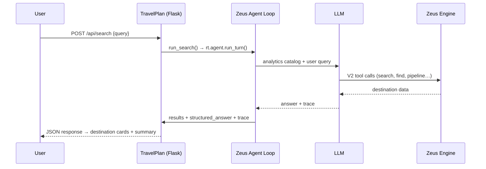

# TravelPlan

A demo travel search app that combines natural-language queries with the [Zeus Engine](https://github.com/koten-ai) and an LLM agent loop. Describe where you want to go in plain English and get destination recommendations backed by real Zeus `travel-sample` data.

Built with **Flask**, **Tailwind CSS**, and **DaisyUI** on the frontend, using [`kotenai-zeus-client` **2.3.0**](https://github.com/koten-ai/zeus_client_python) from the sibling `../zeus_client_python` repo for the Zeus agent loop (boot gate: 2.3.x family).

**Reference demo** for the [Demo Builder Kit](../zeus_client_python/docs/demo-builder/) (build similar apps from docs). GitBook: site section **Demo** → Python.

## Features

- **Natural-language search** — Ask for destinations by vibe, budget, region, or activity (e.g. *"warm beaches in Europe under $2000"*).
- **LLM + Zeus agent loop** — An LLM orchestrates Zeus V2 verbs (`search`, `find`, `pipeline`, etc.) against the `travel-sample.inventory` scope.
- **Destination cards** — Results are extracted from Zeus tool traces, with a markdown answer parser as fallback when the model returns prose instead of structured rows.
- **Zeus trace panel** — Vendored **zeus_client_chat_trace 1.0.0** inspector (not CDN `latest`). Open the app with `?debug=true` and use the lightning toggle (bottom-left).
- **Multi-provider LLM support** — Configure xAI Grok or OpenAI (extensible via `config.json`).
- **Docker-ready** — One-command deployment with hot-reload volumes for local development.

## How It Works



1. The user submits travel preferences through the search UI.
2. Flask calls `run_search()`, which loads the catalog and runs `rt.agent.run_turn()` in `analytics` mode.
3. The LLM decides which Zeus tools to call and synthesizes a natural-language answer.
4. The BFF maps `TurnResult` into destination cards (`results[]`); if hops are empty, `answer_parser` parses the markdown answer into structured JSON.
5. The frontend renders cards and appends the trace to the debug panel.

## Prerequisites

- **Zeus Engine** running and reachable, with the `travel-sample.inventory` scope loaded
- **LLM API key** — xAI Grok (default) or OpenAI
- **Docker** (recommended) or **Python 3.11+**

## Quick Start

### Docker (recommended)

```bash
# 1. Create config from the example and add your LLM API key
cp config.example.json config.json

# 2. Edit config.json — set llm_provider.api_key and verify zeus.url

# 3. Start the app
docker compose up --build
```

Open [http://localhost:5050](http://localhost:5050) (host **5050** → container 5000). Tracer: [http://localhost:5050/?debug=true](http://localhost:5050/?debug=true).

Docker maps `ZEUS_URL` to `http://host.docker.internal:8080` by default so the container can reach Zeus on the host. Adjust `zeus.url` in `config.json` if your Zeus instance runs elsewhere.

### Local development

```bash
# zeus_client_python must live at ../zeus_client_python (monorepo layout)
cp config.example.json config.json
# Edit config.json with your API keys and Zeus URL

pip install -e ".[dev]"
python -m travel_planner
```

The server listens on port `5000` by default. Set `ENVIRONMENT=dev` to enable Flask debug mode. Tracer: [http://localhost:5000/?debug=true](http://localhost:5000/?debug=true).

## Configuration

Copy `config.example.json` to `config.json` (gitignored). Key settings:

| Setting | Description |
|---------|-------------|
| `zeus.url` | Zeus Engine base URL (`ZEUS_URL` overrides at runtime) |
| `llm_provider.api_key` | LLM API key (**required**; overlay maps to `XAI_API_KEY` / `api_key_env`) |
| `llm_provider.models` | Model list; **first entry** is the default |
| `default_mode` / `settings.mode` | Agent mode (`analytics` on Zeus 0.7.x / base-6.1) |
| `default_sample` | Zeus sample (`travel-sample` / `inventory` / `hotel`) |
| `client_floor` | Must be `client-floor-6.1` for Zeus 0.7.x (`base-6.1`). Floor-5 fails closed and the agent runs with no Zeus verbs. |
| `settings.ai_process_result` | Extra insight hop after tools (default **false**) |
| `session.semantic_cache.enabled` | Semantic agent memory (default **false**; Zeus ≥ 0.7.6 to turn on) |

### Environment variables

| Variable | Default | Description |
|----------|---------|-------------|
| `ZEUS_URL` | — | Overrides Zeus URL from config |
| `ZEUS_CLIENT_CONFIG_DIR` | project root | Directory containing `config.json` |
| `ZEUS_CHAT_REQUESTS_DIR` | `data/chat_requests` | Local chat_request catalog snapshots |
| `ZEUS_CLIENT_FLOOR` | `client-floor-6.1` | Overrides `client_floor` from config |
| `PORT` | `5000` | HTTP listen port |
| `CHAT_LOG_PATH` | `data/chats.jsonl` | Chat persistence file |
| `ENVIRONMENT` | — | Set to `dev` for Flask debug mode |

## API

### `POST /api/search`

Search for destinations matching natural-language preferences.

```bash
curl -X POST http://localhost:5000/api/search \
  -H "Content-Type: application/json" \
  -d '{"query": "tropical destinations with great food"}'
```

**Request body:**

```json
{
  "query": "warm beaches in Europe under $2000",
  "chat_id": "optional-existing-chat-id"
}
```

**Response** (abbreviated):

```json
{
  "chat_id": "travel_abc123",
  "query": "warm beaches in Europe under $2000",
  "answer": "Here are some great options…",
  "structured_answer": { "destinations": […] },
  "results": [
    { "name": "Santorini", "description": "…", "image": "…" }
  ],
  "trace": { "tool_calls": […] },
  "model": "grok-4-1-fast-non-reasoning",
  "provider": "grok"
}
```

### `GET /api/tool-order`

Returns the Zeus tool invocation order for V1 and V2 API versions (used by the trace panel).

### `GET /api/health`

Process health: app version, installed `kotenai-zeus-client` version (currently **2.3.0**, must start with `2.3`), and `client_import` (`zeus_client`).

### `GET /`

Serves the TravelPlan search UI.

## Project Structure

```
demo_travel_sample/
├── src/travel_planner/       # Application package
│   ├── app.py                # Flask routes and app factory
│   ├── search.py             # Domain wrapper around ZeusRuntime.agent.run_turn
│   ├── runtime_factory.py    # Nested config.json → ZeusRuntime + ports
│   ├── turn_mapper.py        # TurnResult → /api/search JSON
│   ├── results_parser.py     # Extract destination cards from Zeus traces
│   ├── answer_parser.py      # Markdown answer → structured JSON fallback
│   ├── async_runner.py       # Background loop + process-scoped ZeusRuntime
│   ├── chat_store.py         # Multi-turn chat persistence (JSONL)
│   ├── tool_order.py         # Trace panel tool-order axes
│   ├── zeus_config.py        # Path/env configuration before runtime bind
│   ├── templates/            # Jinja2 HTML (index.html)
│   └── static/               # CSS, JS, pinned zeus_client_chat_trace@1.0.0
├── data/
│   └── chat_requests/        # vendored analytics base-6.1 pin + inventory load path
├── tests/                    # Pytest suite
├── config.example.json       # Configuration template
├── docker-compose.yml
├── Dockerfile
└── pyproject.toml
```

## Development

### Pin / refresh the tracer widget

TravelPlan **vendors** `zeus_client_chat_trace@1.0.0` into `src/travel_planner/static/`. It does not load CDN `latest`.

```bash
./scripts/vendor_trace.sh
```

That rebuilds the sibling `../zeus_client_chat_trace` and copies `dist/` here. Keep the script tag at `/static/zeus_client_chat_trace.js?v=1.0.0` in `templates/index.html` (bump `?v=` when the file changes). See `.grok/guides/PINNED_TRACE_WIDGET.md`.

### Run tests

```bash
pip install -e ".[dev]"
pytest
```

With coverage:

```bash
pytest --cov=travel_planner --cov-report=term-missing
```

Integration tests that require a live Zeus or LLM service are marked with `@pytest.mark.integration`.

### CLI entry point

After installing the package, you can also run:

```bash
travel-planner
```

## Troubleshooting

| Symptom | Likely cause | Fix |
|---------|--------------|-----|
| `no Zeus URL configured` | Missing or empty config | Create `config.json` from `config.example.json` |
| `llm_provider has no api_key` | Empty LLM key | Set `llm_provider.api_key` (or `providers.<name>.api_key`) in `config.json` |
| Agent answers without Zeus tools | Catalog floor too low or missing pin | Set `client_floor` to `client-floor-6.1`. Vendored pin: `data/chat_requests/chat_request_analytics_base-6.1.json` (load path `travel-sample__inventory/chat_request_analytics_v2.json`) |
| Empty destination cards | LLM returned prose only | Check `structured_answer` in the API response |
| Docker can't reach Zeus | Wrong network URL | Set `zeus.url` / `ZEUS_URL` to a host-accessible address (e.g. `http://host.docker.internal:8080`) |
| `kotenai-zeus-client 2.3.x required` | Sibling checkout older than 2.3 (this demo uses **2.3.0**) | Update `../zeus_client_python` and `pip install -e ".[dev]"` |
| `network error` on search | Zeus or LLM unreachable | Verify Zeus is running and API key is valid |

## License

Internal demo project for Koten AI.