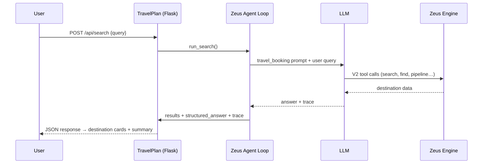

# TravelPlan

A demo travel search app that combines natural-language queries with the [Zeus Engine](https://github.com/koten-ai) and an LLM agent loop. Describe where you want to go in plain English and get destination recommendations backed by real Zeus `travel-sample` data.

Built with **Flask**, **Tailwind CSS**, and **DaisyUI** on the frontend, using the [`kotenai-zeus-client`](https://github.com/koten-ai/zeus_client_python) package from the sibling `../zeus_client_python` repo for the Zeus agent loop.

## Features

- **Natural-language search** — Ask for destinations by vibe, budget, region, or activity (e.g. *"warm beaches in Europe under $2000"*).
- **LLM + Zeus agent loop** — An LLM orchestrates Zeus V2 verbs (`search`, `find`, `pipeline`, etc.) against the `travel-sample/_default` scope.
- **Destination cards** — Results are extracted from Zeus tool traces, with a markdown answer parser as fallback when the model returns prose instead of structured rows.
- **Zeus trace panel** — A floating debug panel shows the full LLM/Zeus execution waterfall for each query.
- **Multi-provider LLM support** — Configure xAI Grok or OpenAI (extensible via `config.json`).
- **Docker-ready** — One-command deployment with hot-reload volumes for local development.

## How It Works



1. The user submits travel preferences through the search UI.
2. Flask calls `run_search()`, which invokes `zeus_client.run_agent()` in `travel_booking` mode.
3. The LLM decides which Zeus tools to call and synthesizes a natural-language answer.
4. `results_parser` extracts destination cards from tool-call traces; if none are found, `answer_parser` parses the markdown answer into structured JSON.
5. The frontend renders cards and appends the trace to the debug panel.

## Prerequisites

- **Zeus Engine** running and reachable, with the `travel-sample/_default` scope loaded
- **LLM API key** — xAI Grok (default) or OpenAI
- **Docker** (recommended) or **Python 3.11+**

## Quick Start

### Docker (recommended)

```bash
# 1. Create config from the example and add your LLM API key
cp config.example.json config.json

# 2. Edit config.json — set providers.<name>.api_key and verify zeus_connections[].url

# 3. Start the app
docker compose up --build
```

Open [http://localhost:5000](http://localhost:5000).

Docker maps `ZEUS_URL` to `http://host.docker.internal:8080` by default so the container can reach Zeus on the host. Adjust `zeus_connections[].url` in `config.json` if your Zeus instance runs elsewhere.

### Local development

```bash
# zeus_client_python must live at ../zeus_client_python (monorepo layout)
cp config.example.json config.json
# Edit config.json with your API keys and Zeus URL

pip install -e ".[dev]"
python -m travel_planner
```

The server listens on port `5000` by default. Set `ENVIRONMENT=dev` to enable Flask debug mode.

## Configuration

Copy `config.example.json` to `config.json` (gitignored). Key settings:

| Setting | Description |
|---------|-------------|
| `zeus.url` or `zeus_connections[].url` | Zeus Engine base URL (legacy `zeus_connections` is normalized on load) |
| `llm_provider.api_key` or `providers.<id>.api_key` | LLM API key (**required**) |
| `llm_provider.models` or `providers.<id>.models` | Model list; first entry is the default |
| `default_mode` | Agent mode (`travel_booking`) |
| `default_sample` | Zeus sample bucket (`travel-sample`) |

### Environment variables

| Variable | Default | Description |
|----------|---------|-------------|
| `ZEUS_URL` | — | Overrides Zeus URL from config |
| `ZEUS_CLIENT_CONFIG_DIR` | project root | Directory containing `config.json` |
| `ZEUS_CHAT_REQUESTS_DIR` | `data/chat_requests` | Local chat_request catalog snapshots |
| `PORT` | `5000` | HTTP listen port |
| `CHAT_LOG_PATH` | `data/chats.jsonl` | Chat persistence file |
| `ENVIRONMENT` | — | Set to `dev` for Flask debug mode |

## API

### `POST /api/search`

Search for destinations matching natural-language preferences.

```bash
curl -X POST http://localhost:5000/api/search \
  -H "Content-Type: application/json" \
  -d '{"query": "tropical destinations with great food"}'
```

**Request body:**

```json
{
  "query": "warm beaches in Europe under $2000",
  "chat_id": "optional-existing-chat-id"
}
```

**Response** (abbreviated):

```json
{
  "chat_id": "travel_abc123",
  "query": "warm beaches in Europe under $2000",
  "answer": "Here are some great options…",
  "structured_answer": { "destinations": […] },
  "results": [
    { "name": "Santorini", "description": "…", "image": "…" }
  ],
  "trace": { "tool_calls": […] },
  "model": "grok-4-1-fast-non-reasoning",
  "provider": "grok"
}
```

### `GET /api/tool-order`

Returns the Zeus tool invocation order for V1 and V2 API versions (used by the trace panel).

### `GET /`

Serves the TravelPlan search UI.

## Project Structure

```
demo_travel_sample/
├── src/travel_planner/       # Application package
│   ├── app.py                # Flask routes and app factory
│   ├── search.py             # Zeus agent wrapper for travel queries
│   ├── results_parser.py     # Extract destination cards from Zeus traces
│   ├── answer_parser.py      # Markdown answer → structured JSON fallback
│   ├── async_runner.py       # Background asyncio loop for httpx
│   ├── chat_store.py         # Multi-turn chat persistence (JSONL)
│   ├── tool_order.py         # Trace panel tool-order endpoint
│   ├── zeus_config.py        # zeus_client env configuration
│   ├── templates/            # Jinja2 HTML (index.html)
│   └── static/               # CSS, JS, trace panel
├── data/
│   └── chat_requests/        # travel_booking catalog snapshot
├── tests/                    # Pytest suite
├── config.example.json       # Configuration template
├── docker-compose.yml
├── Dockerfile
└── pyproject.toml
```

## Development

### Run tests

```bash
pip install -e ".[dev]"
pytest
```

With coverage:

```bash
pytest --cov=travel_planner --cov-report=term-missing
```

Integration tests that require a live Zeus or LLM service are marked with `@pytest.mark.integration`.

### CLI entry point

After installing the package, you can also run:

```bash
travel-planner
```

## Troubleshooting

| Symptom | Likely cause | Fix |
|---------|--------------|-----|
| `no Zeus URL configured` | Missing or empty config | Create `config.json` from `config.example.json` |
| `llm_provider has no api_key` | Empty LLM key | Set `llm_provider.api_key` (or `providers.<name>.api_key`) in `config.json` |
| `no chat_request file for mode 'travel_booking'` | Missing catalog | Ensure `data/chat_requests/by_use_case/chat_request_travel_booking_v2.json` exists |
| Empty destination cards | LLM returned prose only | Check `structured_answer` in the API response |
| Docker can't reach Zeus | Wrong network URL | Set `zeus_connections[].url` to a host-accessible address (e.g. `http://host.docker.internal:8080`) |
| `network error` on search | Zeus or LLM unreachable | Verify Zeus is running and API key is valid |

## License

Internal demo project for Koten AI.